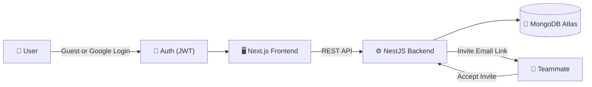
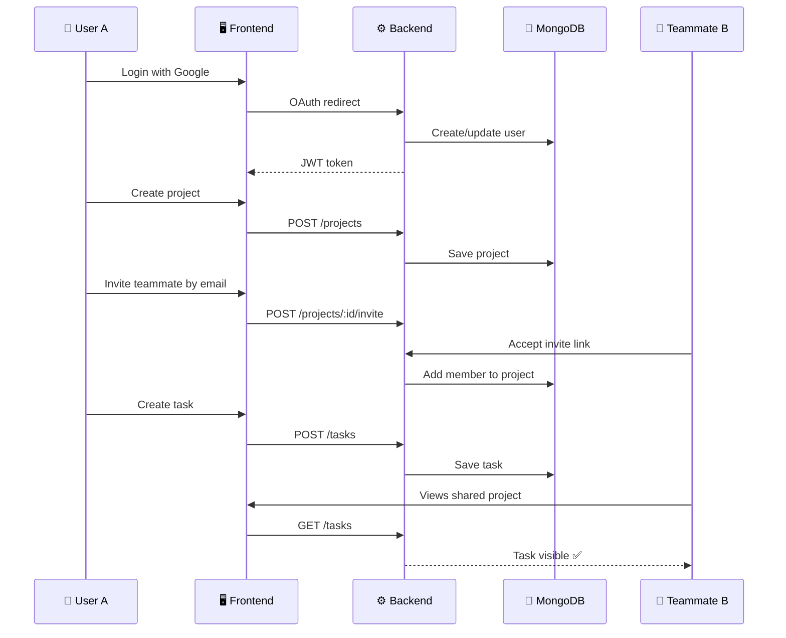

<div align="center">


<br/>

<a href="https://able-space-assignment-frontend-phi.vercel.app"></a>
<a href="https://ablespace-backend-q56m.onrender.com"></a>

<br/><br/>


</div>

---

### 🖇️ Quick Links

<div align="center">

|  | Link |
|---|---|
| 🌐 **Frontend (Vercel)** | [able-space-assignment-frontend-phi.vercel.app](https://able-space-assignment-frontend-phi.vercel.app) |
| ⚙️ **Backend API (Render)** | [ablespace-backend-q56m.onrender.com](https://ablespace-backend-q56m.onrender.com) |

</div>

> ⏳ **Heads up:** the backend runs on Render's free tier, so the very first request after inactivity can take ~30–50s to spin up.

---

## 📖 Overview

**AbleSpace** is a real, working full-stack task & project management app — built from a Figma design brief, not just a static UI clone. Users can log in, create projects, invite teammates, manage tasks in list or board view, and see live shared progress across a team.

<div align="center">



</div>

---

## ✨ Features

<table>
<tr>
<td valign="top" width="33%">

**🔐 Auth & Access**
- Guest login (instant, no signup)
- Google OAuth login
- JWT-protected APIs
- Persistent sessions

</td>
<td valign="top" width="33%">

**✅ Tasks**
- Create / edit / delete
- List view & Kanban board view
- Search tasks
- Filter by status & priority

</td>
<td valign="top" width="33%">

**👥 Projects & Teams**
- Create projects
- Invite teammates via link
- Shared tasks across members
- Leave / delete project

</td>
</tr>
<tr>
<td valign="top" width="33%">

**🎨 UI/UX**
- Theme switching (persists on refresh)
- Fully responsive
- Loading, empty & error states

</td>
<td valign="top" width="33%">

**👤 Profile**
- Edit profile details
- Avatar from Google account
- Guest → real user distinction

</td>
<td valign="top" width="33%">

**🛠️ Engineering**
- Centralized API service layer
- Protected routes by membership
- Clean separation of concerns

</td>
</tr>
</table>

---

## 🧰 Tech Stack

<div align="center">

| Layer | Stack |
|---|---|
| **Frontend** | Next.js (App Router) · TypeScript · Tailwind CSS · React · Lucide Icons · React Hook Form / Zod |
| **Backend** | NestJS · TypeScript · MongoDB Atlas · Mongoose · Passport JWT · Google OAuth · class-validator |
| **Deployment** | Vercel (frontend) · Render (backend) · MongoDB Atlas (database) |

</div>

---

## 🔄 How It Works — Example Flow



---

## 🔑 Authentication Flow

<details open>
<summary><b>👤 Guest Login</b></summary>
<br>

1. User clicks **"Continue as Guest"**
2. Backend creates a guest user record
3. Backend returns a JWT token
4. Frontend stores the token and attaches it to all API requests

</details>

<details>
<summary><b>🔐 Google OAuth Login</b></summary>
<br>

1. User clicks **Google Login**
2. Backend redirects to Google OAuth
3. Google returns the authenticated user's profile
4. Backend creates or updates the corresponding user
5. Backend redirects back to the frontend with a JWT token
6. The user is now a real Google-linked account, not a guest

</details>

---

## 🗄️ Database Schema

<details>
<summary><b>📄 User</b></summary>

```text
_id
googleId
name
email
avatar
isGuest
createdAt
updatedAt
```
</details>

<details>
<summary><b>📄 Task</b></summary>

```text
_id
userId
title
description
status
priority
projectId
project
assignee
label
dueDate
createdAt
updatedAt
```
</details>

<details>
<summary><b>📄 Project</b></summary>

```text
_id
name
description
ownerId
members
createdAt
updatedAt
```
</details>

<details>
<summary><b>📄 Project Invite</b></summary>

```text
_id
projectId
email
token
status
createdAt
updatedAt
```
</details>

---

## 🔌 API Reference

<details>
<summary><b>🔐 Auth Endpoints</b></summary>

| Method | Endpoint | Description |
|---|---|---|
| `POST` | `/auth/guest` | Create a guest session |
| `GET` | `/auth/google` | Start Google OAuth flow |
| `GET` | `/auth/google/callback` | Google OAuth callback |
| `GET` | `/auth/me` | Get current user |
| `PATCH` | `/auth/me` | Update profile |
| `POST` | `/auth/logout` | Log out |

</details>

<details>
<summary><b>✅ Task Endpoints</b></summary>

| Method | Endpoint | Description |
|---|---|---|
| `GET` | `/tasks` | List tasks |
| `GET` | `/tasks/:id` | Get a single task |
| `POST` | `/tasks` | Create a task |
| `PATCH` | `/tasks/:id` | Update a task |
| `DELETE` | `/tasks/:id` | Delete a task |

</details>

<details>
<summary><b>📁 Project Endpoints</b></summary>

| Method | Endpoint | Description |
|---|---|---|
| `GET` | `/projects` | List projects |
| `POST` | `/projects` | Create a project |
| `POST` | `/projects/:id/invite` | Invite a teammate |
| `POST` | `/projects/invites/:token/accept` | Accept an invite |
| `POST` | `/projects/:id/leave` | Leave a project |
| `DELETE` | `/projects/:id` | Delete a project |

</details>

---

## ⚡ Getting Started

### 1. Clone & install

```bash
git clone <this-repo-url>
cd "AbleSpace Assignment"
npm install
```

### 2. Environment variables

**Frontend (Vercel):**
```env
NEXT_PUBLIC_API_URL=https://ablespace-backend-q56m.onrender.com
```

**Backend (Render):**
```env
MONGODB_URI=your_mongodb_uri
MONGODB_DB_NAME=your_database_name
GOOGLE_CLIENT_ID=your_google_client_id
GOOGLE_CLIENT_SECRET=your_google_client_secret
JWT_SECRET=your_secret
FRONTEND_URL=https://able-space-assignment-frontend-phi.vercel.app
BACKEND_URL=https://ablespace-backend-q56m.onrender.com
```

> 🔒 Never commit secrets into code — they belong only in environment variables.

### 3. Run locally

```bash
# backend
npm run dev:backend

# frontend
npm run dev:frontend
```

### 4. Verify

```bash
npm run build       # build check
npm run typecheck    # type check
```

---

## ✅ Pre-Submission Test Checklist

- [x] Guest login works
- [x] Google login works
- [x] Logout works
- [x] Create / edit / delete task
- [x] Search & filter tasks (status, priority)
- [x] Create project
- [x] Invite link works
- [x] Invited user sees shared project tasks
- [x] Profile edit works
- [x] Theme persists after refresh
- [x] Responsive on mobile & desktop
- [x] Production frontend calls Render backend, not localhost

---

## 🎓 Interview Talking Points

<details>
<summary>Click to expand key architecture explanations</summary>
<br>

- Why the **frontend and backend are separate deployments**
- How **JWT authentication** protects API routes
- Why **secrets live in environment variables**, never in code
- How the **Google OAuth callback** flow works end-to-end
- How **MongoDB schemas** are structured across Users, Tasks, Projects, Invites
- How **task access is scoped** to authenticated users / project membership
- How the frontend **centralizes API calls** in a services layer
- How **search & filter** are handled in frontend state
- How **Vercel ↔ Render** are wired together for production
- Why `NEXT_PUBLIC_API_URL` is safe to expose but backend secrets are not

</details>

---

## ⚠️ Known Limitations

| Limitation | Detail |
|---|---|
| ✉️ Invite delivery | No real SMTP — invites use an accept-link / `mailto` flow |
| 🔑 OAuth setup | Google login depends on a correctly configured redirect URI in Google Cloud |
| 🐢 Cold starts | Render's free tier sleeps — first request after idle can be slow |
| 🎨 Design fidelity | Figma Dev Mode access was limited; UI was matched visually from available screenshots |

---

<div align="center">

Built as a full-stack take-home assignment — real auth, real database, real deployment.

⭐ **Frontend:** [able-space-assignment-frontend-phi.vercel.app](https://able-space-assignment-frontend-phi.vercel.app) &nbsp;·&nbsp; ⚙️ **Backend:** [ablespace-backend-q56m.onrender.com](https://ablespace-backend-q56m.onrender.com)

</div>
