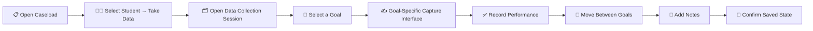

 

---

## 📌 Overview

This document breaks down the **Take Data** workflow inside AbleSpace — how a user moves from the **Caseload** screen to recording a student's performance against their configured goals. It covers the workflow steps, the different data-entry patterns the interface supports, and a set of UX improvements based on hands-on exploration of the demo student environment.

> **In one line:** AbleSpace's Take Data workflow is goal-driven — the data entry UI reshapes itself based on which goal you select.

---

## 🧭 End-to-End Workflow

---

## 🎯 Data Entry Patterns Observed

The Capture interface adapts entirely depending on the goal selected — the same workflow supports five distinct interaction models:

<table>
<tr>
<th>Pattern</th>
<th>Example Goal</th>
<th>How It Works</th>
</tr>
<tr>
<td>🎲 <b>Trial Based Recording</b></td>
<td>Social Studies</td>
<td>Large interaction control logs each attempt; goal can be marked complete after recording.</td>
</tr>
<tr>
<td>☑️ <b>Task Based Recording</b></td>
<td>Writing</td>
<td>Individual tasks shown with checkboxes and a "Select All" option for multi-task goals.</td>
</tr>
<tr>
<td>📊 <b>Percentage & Accuracy Tracking</b></td>
<td>Math</td>
<td>Displays prompted %, accuracy %, attempts, and prompts, with Correct / Incorrect / Cue controls.</td>
</tr>
<tr>
<td>🏷️ <b>Categorical Recording</b></td>
<td>Reading</td>
<td>User selects from categories (Independent, 1 Prompt, 2+ Prompts, No Response) instead of a numeric input.</td>
</tr>
<tr>
<td>🗣️ <b>Prompt Level Observation</b></td>
<td>Toileting / Behavior</td>
<td>Categories reflect the level of verbal/visual prompting needed — qualitative rather than numeric.</td>
</tr>
</table>

---

## 🧩 Session Interface Structure

- **Goals Panel (left):** search, filter, and add controls for navigating configured goals
- **Capture Area (right):** the goal-specific data entry interface described above
- **Tabs:** `Capture` · `Graph` · `Stats` · `Info`
- **Notes Section:** add a formatted student note directly within the session
- **Save Feedback:** header displays **"All changes Saved"** as live confirmation of persistence

---

## 🔍 UX Observations

<b>1. Different interaction models per goal</b>

 
Provides flexibility, but a user may hit an unfamiliar interaction pattern each time they switch goals.

<b>2. Truncated goal descriptions</b>

 
Goal cards show shortened text in the side panel; full context often requires selecting the goal first.

<b>3. Goal navigation at scale</b>

 
The Goals panel has its own scroll area — larger caseloads mean more scrolling to find a specific goal.

<b>4. Repetitive data entry</b>

 
Several measurement types need repeated clicks/taps. Fine for structured collection, but experienced users would benefit from faster input paths.

<b>5. Strong save-state feedback ✅</b>

 
The visible "All changes Saved" indicator is a genuine strength — it removes uncertainty about whether data was persisted.

---

## 🚀 Proposed Improvements

| Priority | Improvement | Expected Benefit |
|:---:|---|---|
| 🔴 **High** | Show full goal descriptions via expandable cards or tooltips | Better comprehension without widening the Goals panel |
| 🔴 **High** | Add short contextual guidance per measurement type | Flattens the learning curve when switching between goal interfaces |
| 🟡 **Medium** | Improve goal search / add "Jump to Goal" navigation | Less scrolling, faster for high-volume caseloads |
| 🟡 **Medium** | Add keyboard shortcuts for Correct / Incorrect / Cue | Speeds up repetitive data entry for experienced users |

---

## 🏁 Conclusion

AbleSpace's Take Data workflow is built around **goal-based data collection**: Caseload → Student → Take Data → Goal → Capture. It flexibly supports trial-based, task-based, percentage/accuracy, categorical, and prompt-level recording, backed by clear save-state feedback. The biggest wins going forward are in **discoverability**, **goal navigation at scale**, **in-context guidance**, and **efficiency for repetitive entry**.

📄 Full write-up: [`AbleSpace_Product_Understanding_Part_2.pdf`](./AbleSpace_Product_Understanding_Part_2.pdf)

